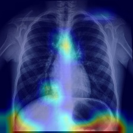

# 🩺 Medical Image Diagnosis System

An AI-powered medical image diagnosis system for pneumonia detection using chest X-ray images.

Built using:
- PyTorch
- AlexNet
- Transfer Learning
- Grad-CAM
- Streamlit

---

# 🚀 Features

✅ Pneumonia Detection  
✅ Transfer Learning with AlexNet  
✅ Confidence Score Prediction  
✅ Grad-CAM Heatmap Visualization  
✅ Streamlit Web Dashboard  

---

# 🧠 Model Architecture

- AlexNet pretrained on ImageNet
- Fine-tuned on Chest X-ray Pneumonia Dataset

---

# 📂 Dataset

Dataset used:

Chest X-Ray Images (Pneumonia)

Source:
https://www.kaggle.com/datasets/paultimothymooney/chest-xray-pneumonia

---

# 🖥️ Streamlit Dashboard

The dashboard allows users to:

- Upload X-ray images
- Detect pneumonia
- View confidence score
- Visualize Grad-CAM heatmap

---

# 📸 Sample Output

## Grad-CAM Visualization



---

# ⚙️ Installation

## Clone Repository

```bash
git clone https://github.com/YashwantSinghSonwaniya/Medical-Image-Diagnosis-System.git
```

## Install Dependencies

```bash
pip install -r requirements.txt
```

## Run Application

```bash
streamlit run backend/app.py
```

---

# 🛠️ Tech Stack

- Python
- PyTorch
- OpenCV
- Streamlit
- NumPy
- Matplotlib

---

# 📌 Future Improvements

- Multi-disease detection
- Better CNN architectures
- Cloud deployment
- Real-time hospital integration

---

# 👨‍💻 Author

Yashwant Singh Sonwaniya